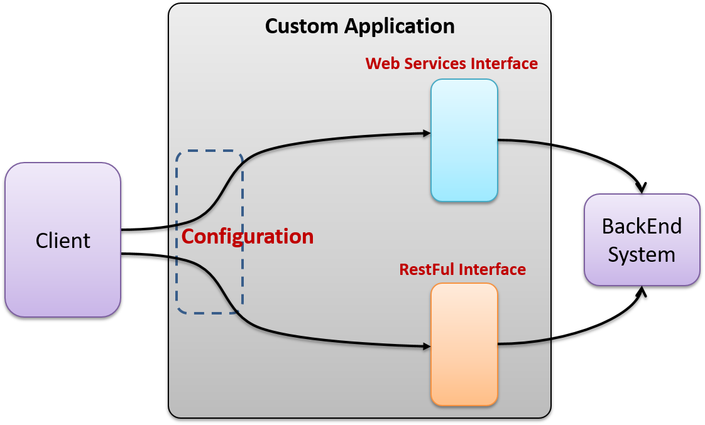

# Abstract Factory - Explicación del escenario

Existen ocasiones donde nuestra aplicación necesita soporte para conectarse al backEnd mediante dos estrategias, esto es utilizado cuando queremos darle la oportunidad a nuestros clientes que eligen qué tipo de conexión les parece mejor; por ejemplo, podemos crear una aplicación que se comunique al sistema backEnd mediante servicios SOA o RestFul, sin embargo, será el cliente quien tome esta decisión, por lo que nuestro sistema debe estar preparado para soportar esta Arquitectura.

En la imagen, el cliente intenta comunicarse al servidor de BackEnd, para lo cual existen dos escenarios: realizar la invocación por WebService o por servicios RestFul. La aplicación estará preparada mediante configuración para determinar en tiempo de ejecución qué servicio utilizará, lo interesante de la configuración es que se puede mover en cualquier momento y la aplicación seguirá funcionando como si nada hubiera pasado.

Nuestra solución tiene que implementar un mecanismo que nos permita intercambiar la forma de invocar los servicios del backEnd, el sistema backEnd proporciona varios servicios por lo que será necesario crear una clase por cada uno de modo que cada una defina métodos para crear las clases de los servicios.