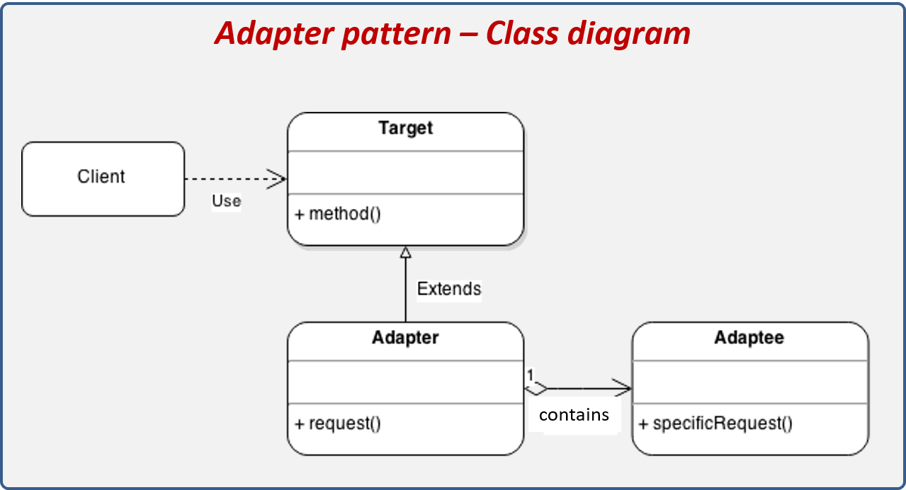
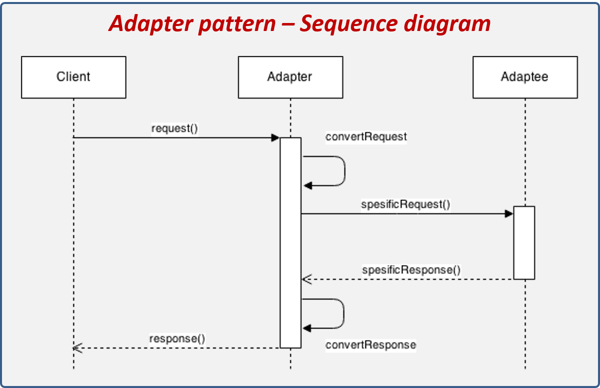
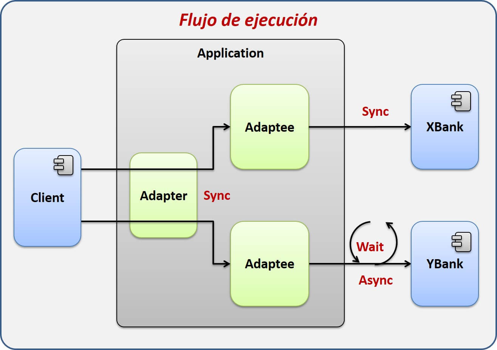

# Adapter

El patrón de diseño Adapter es utilizado cuando tenemos interfaces de software incompatibles, las cuales a pesar de su incompatibilidad tiene una funcionalidad similar. Este patrón es implementado cuando se desea homogeneizar la forma de trabajar con estas interfaces incompatibles, para lo cual se crea una clase intermedia que funciona como un adaptador. Esta clase adaptador proporcionará los métodos para interactuar con la interface incompatible.

#### Los componentes que conforman el patrón son los siguientes:

* Client: Actor que interactua con el Adapter.
* Target: Interface que nos permitirá homogenizar la forma de trabajar con las interfaces incompatibles, esta interface es utilizada para crear los Adapter.
* Adapter: Representa la implementación del Target, el cual tiene la responsabilidad de mediar entre el Client y el Adaptee. Oculta la forma de comunicarse con el Adaptee.
* Adaptee: Representa la clase con interface incompatible.

#### Pasos de ejecución:

* El Client invoca al Adapter con parámetros genéricos.
* El Adapter convierte los parámetros genéricos en parámetros específicos del Adaptee.
* El Adapter invoca al Adaptee.
* El Adaptee responde.
* El Adapter convierte la respuesta del Adaptee a una respuesta genérica para el Client.
* El Adapter responde al Client con una respuesta genérica.

## Explicación del escenario

Para este ejemplo imaginaremos que tenemos un sistema encargado de realizar préstamos personales por medio de bancos. Nuestro sistema lo que hará es utilizar las API’s proporcionadas por los bancos para comunicarnos con ellos, esto con el fin de validar si el banco le puede prestar la cantidad solicitada, el sistema se tendrá que ir a los dos bancos para validar esta información y decirle al cliente si es posible prestarle el efectivo.

Sin embargo, no todo es tan simple ya que cada banco brinda sus propias API´s para comunicarse con ellos. El primer banco XBank proporciona una interface síncrona y el segundo banco YBank proporciona una interface asíncrona. Cada API en esencia requiere la misma información para hacer la solicitud, sin embargo, el nombre de las clases, variables y tipos de datos son distintos entre cada API´s.

Para comprender mejor cómo es que funciona este patrón realizaremos un ejemplo simple. Se ha solicitado crear una aplicación que, como parte de su proceso de inicio, cargue la configuración persistida en un archivo de propiedades, esta configuración deberá estar disponible para toda la aplicación incluyendo los módulos que ésta podría tener. Dicha configuración tiene un requerimiento especial y es que deberá existir un solo objeto de configuración en toda la aplicación, en la cual todos los módulos puedan interactuar, de tal manera que si un módulo afecta alguna propiedad de la configuración el resto del módulo lo pueda ver reflejado.

Como vemos en la imagen, un banco recibe peticiones síncronas y otra asíncronas. Los tipos y nombre de los parámetros son distintos por lo que es imposible ejecutarlos de la misma manera, esto nos obliga a realizar dos procesos independientes de invocación, donde cada proceso se adecúa a las características del API.

Nuestro trabajo consiste en implementar un mecanismo que nos permita ejecuta las dos API´s de una forma genérica, de tal forma que el cliente siempre envié y reciba lo mismo sin importar que API utilice. Esta solución también debe ser compatible con nuevos bancos que se puedan agregar en el futuro.