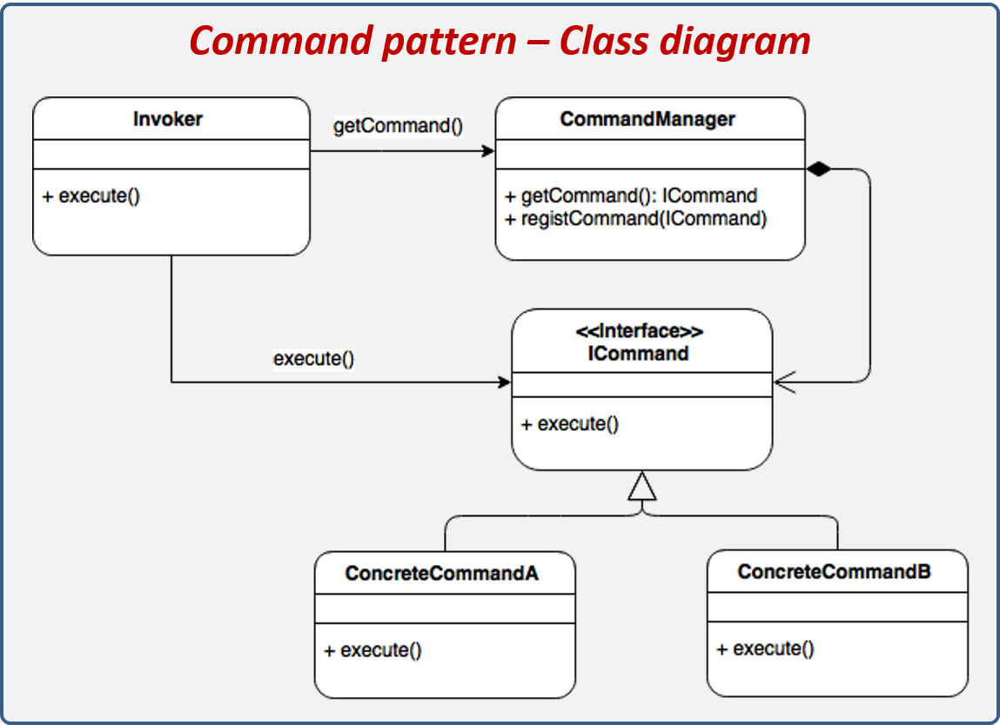
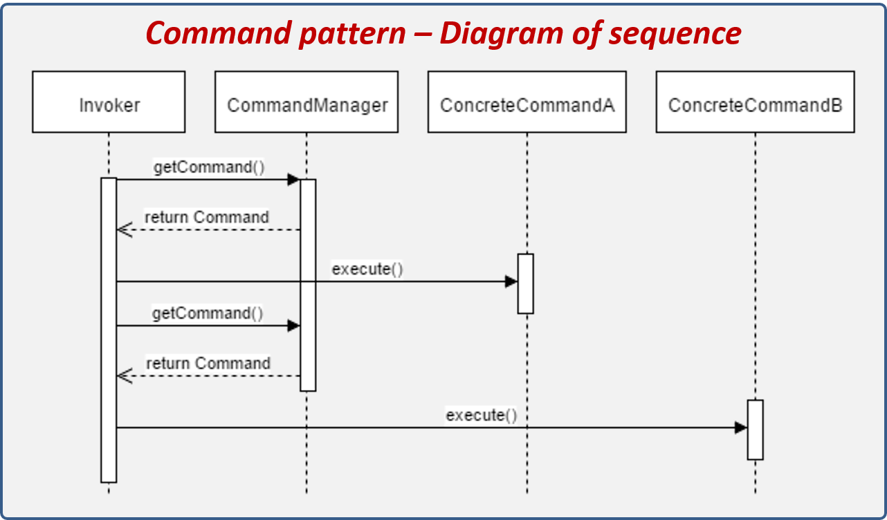
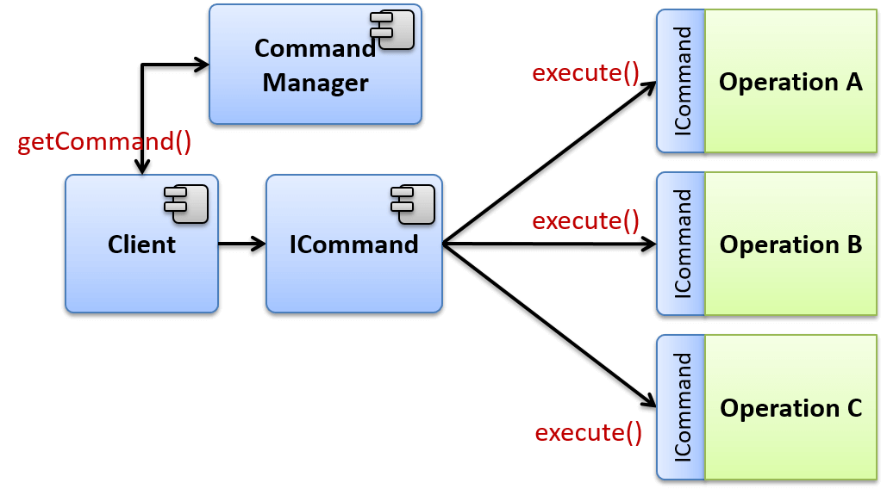

# Command
El patrón de diseño Command nos permite ejecutar operaciones sin conocer los detalles de la implementación de la misma. Las operaciones son conocidas como comandos y cada operación es implementada como una clase independiente que realiza una acción muy concreta, para lo cual, puede o no recibir parámetros para realizar su tarea. Una de las ventajas que ofrece este patrón es la de poder crear cuántos comandos requerimos y encapsularlos bajo una interface de ejecución.

#### Los componentes que conforman el patrón son los siguientes:

Los elementos del patrón Command se describen a continuación:

* ICommand: Interface que describe la estructura de los comandos, la cual define el método de ejecución genérico para todos los comandos.
* Concrete Command: Representan los comandos concretos, éstos deberán heredar de ICommand. Cada una de estas clases representa un comando que podrá ser ejecutado de forma independiente.
* Command Manager: Este componente nos servirá para administrar los comandos que tenemos disponibles en tiempo de ejecución, desde aquí podemos solicitar los comandos o registrar nuevos.
* Invoker: El invoker representa la acción que dispara alguno de los comandos.

* El invoker obtiene un Comando del CommandManager.
* El invoker ejecuta el comando.
* El invoker obtiene otro Comando del CommandManager.
* El invoker ejecuta el comando.

#### Pasos de ejecución:

* El cliente solicita al Factory un Objeto.
*  El Factory crea un Proxy que encapsule al Object.
*  El cliente ejecuta el Proxy creado por el Factory.
*  El Proxy realiza una o varias acciones previas a la ejecución del Object.
*  El Proxy delega la ejecución al Object.
*  El Proxy realiza una o varias acciones después de la ejecución del Object.
*  El Proxy regresa un resultado.

## Command - Explicación del escenario
En este escenario implementaremos nuestra propia Consola. Las consolas responden a base de comandos, estos comandos pueden o no necesitar parámetros para funcionar. Lo asombroso aquí es que la consola tiene la característica de saber siempre qué operación va a realizar sin tener que decirle qué clase o qué software utilice para realizar la tarea, ya que la consola es capaz de determinar el comando utilizado y ejecutar el componente o software que realizar la operación.

Otro punto importante es que la consola tiene la característica de agregarle comandos a medida que instalamos nuevo software como es el caso de Java, si intentamos ejecutar el comando java –version, con una computadora la cual no tiene instalado Java, verán que nos arrojará un mensaje de comando no encontrado (El mensaje dependerá del sistema operativo utilizado), sin embargo, si ejecutas de nuevo el comando una vez instalado java, entonces obtendrás un mensaje como el siguiente: Java version “1.7.0_51? (por ejemplo).

El patrón Command nos permite registrar nuevos comandos mediante el componente CommandManager.

Podemos ver cómo el cliente interactúa con tres operaciones distintas. Al no utilizar el patrón de diseño Comando, está obligado a conocer la implementación exacta y la operación que tendrá que ejecutar, obligándonos a tener una secuencia de elseif o un switch para ejecutar la operación. Además, si una nueva operación es agregada tendríamos que modificar el programa para implementar la lógica de ejecución de la operación.

La consola que implementaremos deberá tener las siguientes operaciones:

* Exit: Finaliza la consola y termina con nuestro programa.
* Memory: Nos muestra en pantalla la cantidad de memoria total disponible, utilizada y máxima que podemos utilizar.
* Echo: Clásico comando utilizado para hacer un eco de lo escrito en pantalla.
* Date: Comando que nos imprime en pantalla la hora y la fecha.
* File: Comando que nos permite interactuar con archivos implementando operaciones básicas como crear, borrar o escribir.
* Dir: Nos permite realizar operaciones con directorios, ya sea crearlos o borrarlos.
* WaitHello: Comando que nos permite demostrar la ejecución en segundo plano, este comando al ejecutarse escribe “Hello!” Después de un tiempo determinado.
* Batch: Comando que ejecuta en lote un conjunto de comandos definidos en un archivo de texto.
Desde luego que los comandos aquí descritos son bastante simples ya que el objetivo es demostrar la utilización del patrón comando. Así que deberemos dejar preparada la consola para agregar nuevos comandos más adelante.