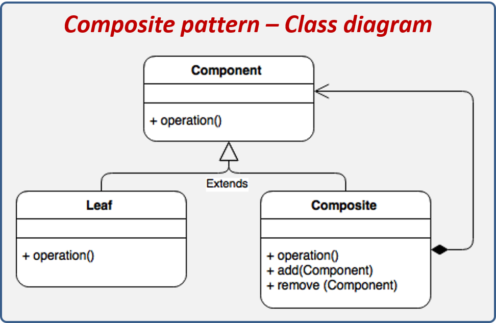
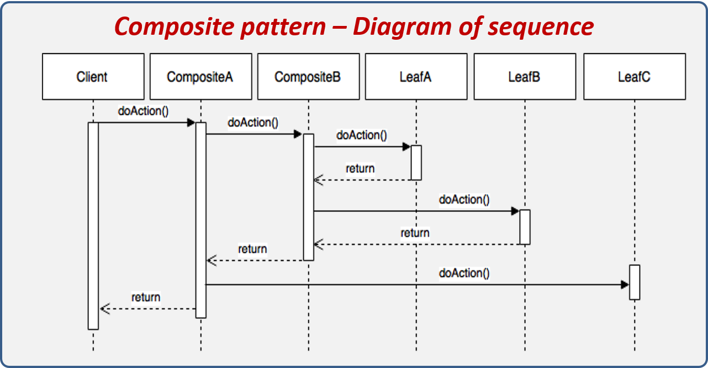
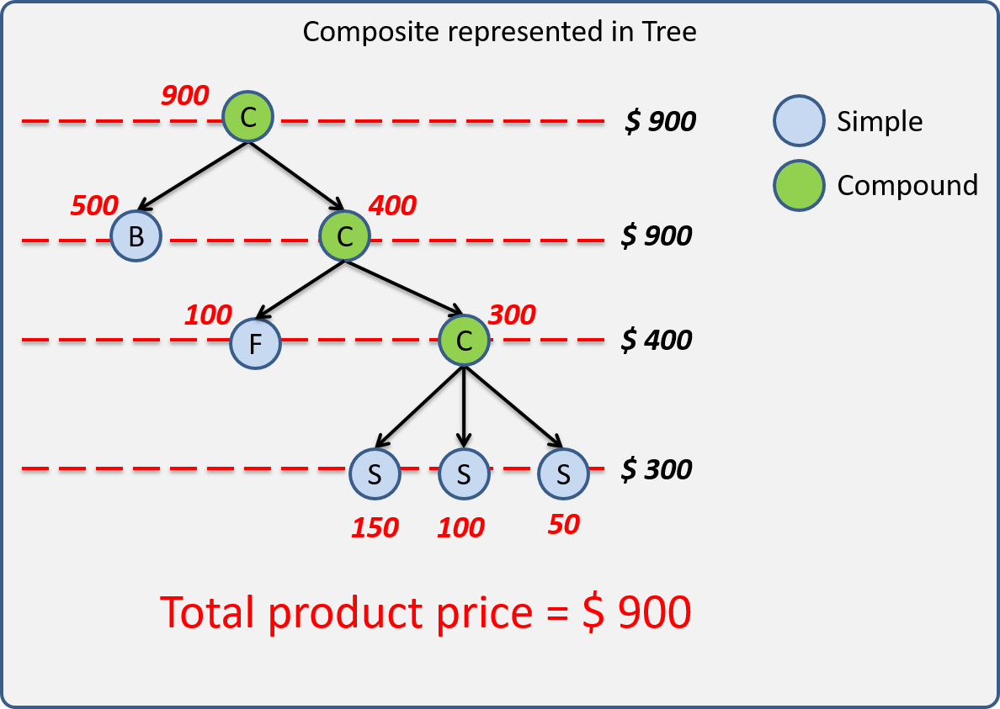

# Composite
El patrón de diseño Composite nos sirve para construir estructuras complejas partiendo de otras mucho más simples; dicho de otra manera, podemos crear estructuras compuestas que están conformadas por otras estructuras más pequeñas.

#### Los componentes que conforman el patrón son los siguientes:

Los componentes del patrón se explican a continuación:

* Component: Generalmente es una interface o clase abstracta que tiene las operaciones mínimas que serán utilizadas, este componente deberá ser extendido por los otros dos componentes Leaf y Composite.
* Leaf: El leaf u hoja, representa la parte más simple o pequeña de toda la estructura y ésta hereda de Component. Leaf recibe su nombre de la teoría de árboles, donde se le nombra así a todo nodo que no tiene descendencia, en este caso son clases simple que no están compuestas de otras.
* Composite: Este componente es el que le da vida al patrón de diseño ya que este objeto está conformado por un conjunto de Component y Leaf. En teoría de árboles este componente representaría una rama.

#### Pasos de ejecución:

* El cliente realizar una acción sobre el CompositeA.
* CompositeA a su vez realiza una acción sobre CompositaB.
* CompositeB realiza una acción sobre LeafA y LeafB y el resultado es devuelto a CompositeA.
* CompositeA propaga la acción sobre LeafC, el cual le regresa un resultado.
* CompositeA obtiene un resultado final tras la evaluación de toda la estructura y el cliente obtiene un resultado.

## Composite - Explicación del escenario
Imaginemos un sistema de punto de venta, en el cual se le pueden vender al cliente una serie de productos, estos productos pueden ser simples (Leaf) o paquetes (Composite). El sistema permitirá crear órdenes de ventas que estarán compuestas por uno o muchos productos.

El precio de los productos deberá ser calculado mediante la suma del precio de todos los productos internos. La siguiente imagen ilustra la estructura de un paquete y cómo es que el precio del mismo es calculado basado en el precio de los productos que lo componen.

En la imagen podemos apreciar la estructura que conforma un producto compuesto, los productos compuestos están conformados por productos simples y por productos compuestos. Los productos compuestos internos pueden a la vez estar creados por más productos simples y compuestos creando una estructura en forma de árbol.

Algunos puntos importantes a tomar en cuenta:

* Un paquete es creado mediante una serie de productos simples y compuestos.
* No debe existir una diferencia entre la forma que tratamos un producto simple de uno compuesto.
* El precio de un paquete es la suma de todos los productos simples que contenga.
* El sistema deberá mostrar el total de la orden y los productos que contiene.