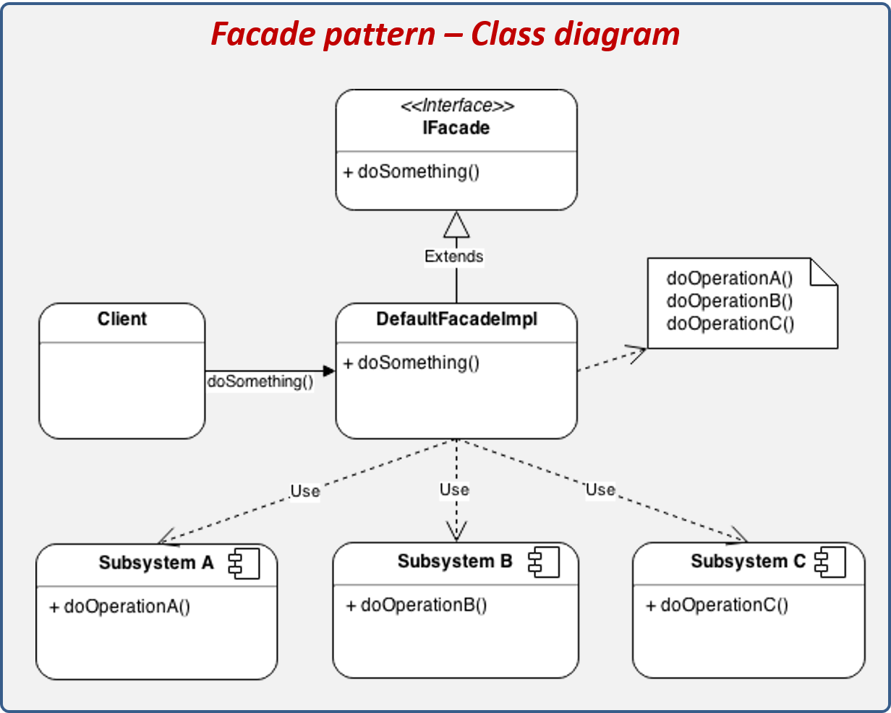
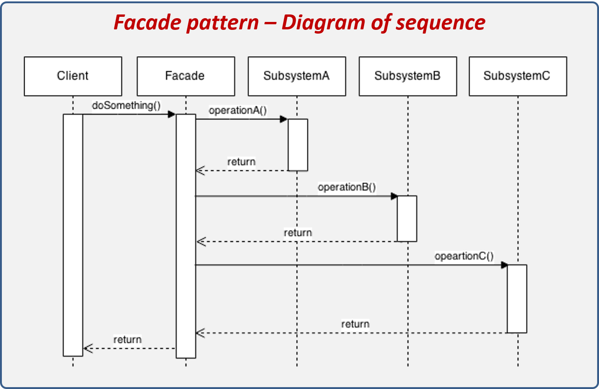
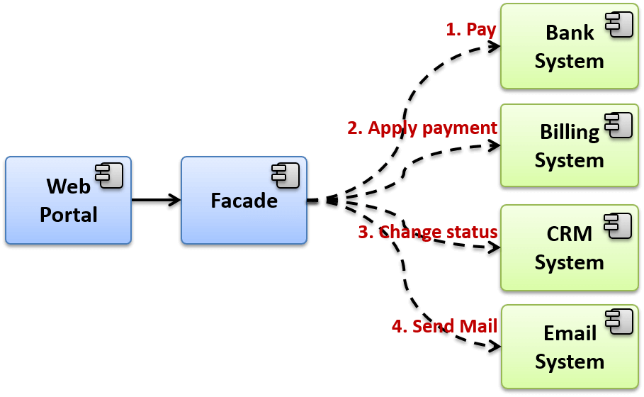

# Facade
El patrón Facade (fachada) tiene la característica de ocultar la complejidad de interactuar con un conjunto de subsistemas proporcionando una interface de alto nivel, la cual se encarga de realizar la comunicación con todos los subsistemas necesarios. La fachada es una buena estrategia cuando requerimos interactuar con varios subsistemas para realizar una operación concreta ya que se necesita tener el conocimiento técnico y funcional para saber qué operaciones de cada subsistema tenemos que ejecutar y en qué orden, lo que puede resultar muy complicado cuando los sistemas empiezan a crecer demasiado.

#### Los componentes que conforman el patrón son los siguientes:

En la imagen podemos apreciar los componentes que integran el patrón Facade, los cuales se explican a continuación:

* **IFacade:** Proporciona una interface de alto nivel que oculta la complejidad de interactuar con varios sistemas para realizar una operación.
* **Client:** Sistema o evento que interactúa con la fachada.
* **DefaultFacadeImpl:** Representa la implementación de IFacade y se encarga de comunicarse con todos los subsistemas.
* **Subsystems:** Representa módulos o subsistemas que exponen interfaces para comunicarse con ellos.

#### Pasos de ejecución:

* El cliente invoca una operación de la fachada.
* La fachada se comunica con el SubsystemA para realiar una operación.
* La fachada se comunica con el SubsystemB para realiar una operación.
* La fachada se comunica con el SubsystemC para realiar una operación.
* La fachada responde al cliente con el resultado de la operación.

## Facade - Explicación del escenario

Para este ejemplo imaginemos que nuestro cliente tiene un portal web desde el cual puede brindar ciertos servicios a sus clientes, sin embargo, nuestro cliente nos ha pedido que agreguemos una nueva funcionalidad que le permita hacer pagos en línea. El pago en línea no sólo implica hacer el cobro, si no que tenemos que afectar a varios subsistemas para que el pago sea aplicado correctamente y el cliente sea notificado que el pago se realizó exitosamente.

Nuestro cliente ya cuenta con algunos subsistemas con los cuales será necesario interactuar, los subsistemas que tiene el cliente son:

* **BankSystem:** Sistema de bancos que le permite realizar los cargos a los clientes por medio de los datos de la tarjeta de crédito o débito.
* **BillingSystem:** Sistema de facturación, este sistema tiene el detalle del saldo del cliente.
* **CRMSystem:** Sistema en donde gestiona la información del cliente.
* **EmailSystem:** Componente de software que utiliza para mandar correos electrónicos a sus clientes.

Cuando el cliente introduzca los datos de su tarjeta y confirme el pago, el sistema deberá hacer lo siguiente:

1. Ir al sistema de Bancos y aplicar el pago. a. El sistema valida que los bines (Prefijo del número de tarjeta que identifica) sean válidos.
1. Ir al sistema de facturación y aplicar el pago realizado. a. El sistema validó que el monto de pago no sea mayor al saldo del cliente.
1. Ir al sistema CRM y afectar el status del cliente cuando se realice un pago.
1. El status del cliente cambia a Activo únicamente cuando el saldo, después del pago, es menor o igual a 50$.
1. Ir al modulo de envio de correos electrónicos y notificar al cliente del pago realizado.
**Bins:** Corresponde a los primeros dígitos de una tarjeta que identifica de qué proveedor es (AMEX, VISA, MASTERCARD), así como el banco al que pertenece y si es de crédito o débito.

Otras reglas que se deben de tener en cuenta son que el cliente debe de existir para aplicar el pago y que el status de éste no sea ‘Baja’, ya que indica que este cliente ya canceló el servicio.

Un esquema que podríamos ver es el siguiente:

El escenario que estamos viendo en la imagen es más común de lo que puedan imaginar, sin embargo, en la mayoría de los casos es un pésimo diseño, ya que el portal web debe de conocer la implementación de todos los subsistemas, debe conocer las operaciones a ejecutar y saber el orden en el que tienen que hacerlo.

También tiene el riesgo de que si la interface de algunos de los subsistemas cambia, afectará directamente al portal web, teniendo que modificar la aplicación, recompilar y subir el cambio.

Es por esta razón que nos ha solicitado diseñar una solución que le permita realizar el pago desde el portal web de una manera más segura y fácil de implementar.que el cliente es el encargado de validar si tiene privilegios, luego ejecutar el proceso y finalmente hacer la auditoria. Este escenario plantea dos problemas: el primero es que si agregamos una acción previa o posterior a la ejecución del proceso tendremos que modificar al Client para que realice esta acción, la segunda es que el cliente se está encargando de hacer los pasos previos y posteriores, siendo que está no es responsabilidad del cliente, ya que a él lo único que le interesa es ejecutar los procesos.