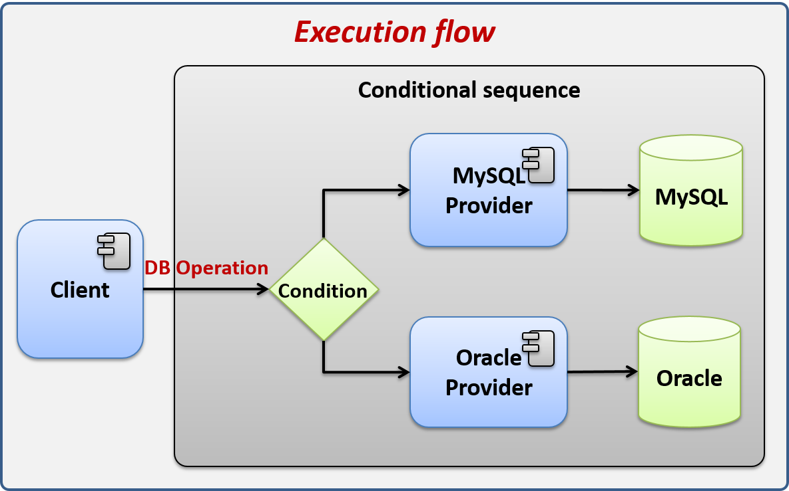

# Factory Method - Explicación del escenario

Es probable que en este punto no tengamos muy claro cómo utilizar este patrón, por lo que lo explicaremos con un ejemplo: Imaginemos un escenario donde deseamos tener la opción de conectarnos a dos bases de datos distintas, como Oracle y MySQL, esto podría darse por la necesidad de darle a los usuarios de nuestra aplicación la posibilidad de tener una base de datos robusta como Oracle, o una opción más económica como MySQL. Sea cual sea el motivo por el cual el usuario decide utilizar una base de datos, nosotros tenemos que tener los mecanismos para soportarla.

Para esto desarrollaremos una clase de acceso a datos (DAO) de productos que nos permite guardar productos y consultarlos, el principal objetivo es que el cliente pueda utilizar el mismo DAO sin la necesidad de cambiar de clase dependiendo la base de datos a utilizar.

