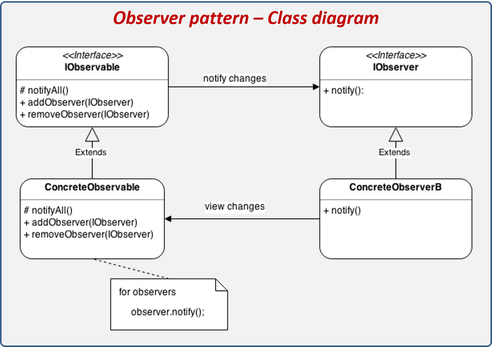
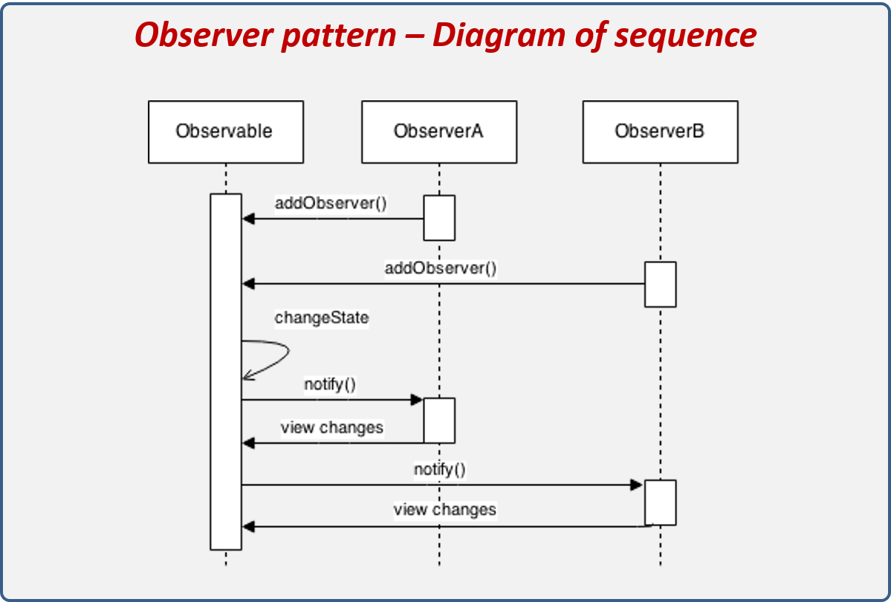
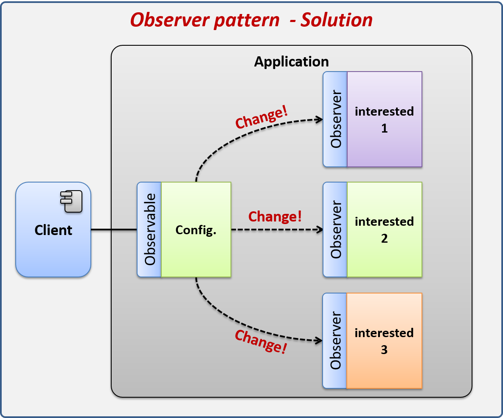

# Observer

El patrón de diseño Observer permite observar los cambios producidos por un objeto, de esta forma, cada cambio que afecte el estado del objeto observado lanzará una notificación a los observadores; a esto se le conoce como Publicador-Suscriptor. Observer es uno de los principales patrones de diseño utilizados en interfaces gráficas de usuario (GUI), ya que permite desacoplar al componente gráfico de la acción a realizar.

####Los componentes que conforman el patrón son los siguientes:

* IObservable: Interface que deben de implementar todos los objetos que quieren ser observados, en ella se definen los métodos mínimos que se deben implementar.
* ConcreteObservable: Clase que desea ser observada, ésta implementa IObservable y debe implementar sus métodos.
* IObserver: Interfaces que deben implementar todos los objetos que desean observar los cambios de IObservable.
* ConcreteObserver: Clase concreta que está atenta de los cambios de IObserver, esta clase hereda de IObserver y debe de implementar sus métodos.

####El flujo de ejecución es el siguiente:

* El ObserverA se registra con el objeto Observable para ser notificado de algún cambio.
* El ObserverB se registra con el objeto Observable para ser notificado de algún cambio.
* Ocurre algún cambio en el estado del Observable.
* Todos los Observers son notificados con el cambio ocurrido.

## Observer - Explicación del escenario

Nos han pedido que desarrollemos una aplicación de escritorio, la cual al iniciar cargue la configuración de Internacionalización (I18N). Entre las configuraciones tenemos el formato de Fecha y Moneda, éstas serán necesarias en el programa para mostrar la fecha y la moneda en un formato configurado por el usuario según su localización geográfica, sin embargo, el usuario puede cambiar esta configuración en cualquier momento; lo que implica que en todas las partes donde se esté utilizando un formato de fecha o moneda deberán ser notificados del cambio para aplicar el formato correspondiente.

Uno de los principales problemas es que cuando alguna configuración cambie, todos los interesados deberán ser notificados de inmediato por lo que se deberá implementar un mecanismo que nos permita hacer esto.

La imagen anterior demuestra cómo es que normalmente estaríamos observando si se realizó algún cambio en la configuración. Lo primero que vemos es que los interesados son los que tienen que preguntar a la configuración si algún cambio ocurrió, esto provoca tres problemas:

1. No sabremos de inmediato que algún cambio se realizó en la configuración hasta que vayamos a preguntarle.
2. Los interesados están totalmente acoplados a la configuración por lo que tendrán que tener una referencia directa a éste.
3. Tenemos que programar algún mecanismo que le esté preguntando a la configuración si se realizó algún cambio, esto puede ser algún pooling o monitoreo constante, lo cual puede resultar complicado de programar.

Por esta razón tenemos que implementar un mecanismo que nos permita que la configuración notifique a los interesados en el momento en que algún cambio ocurra.