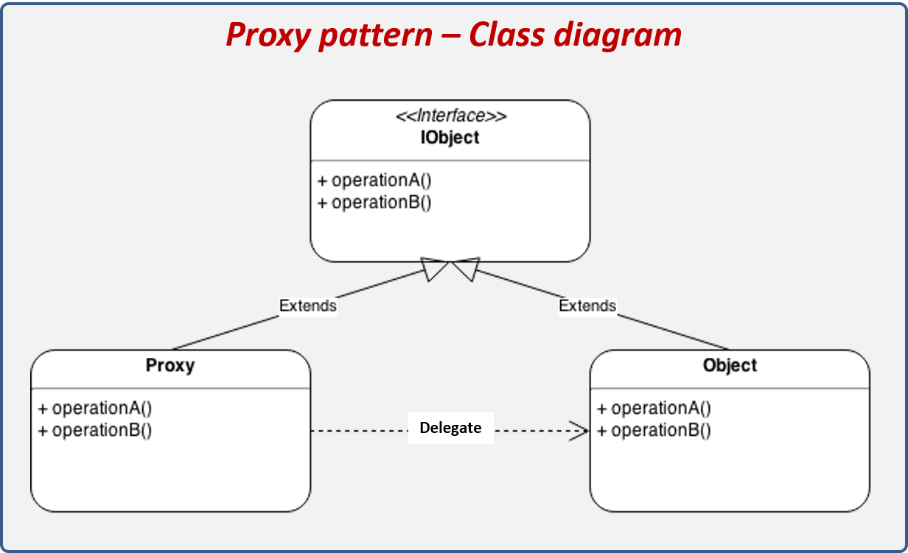
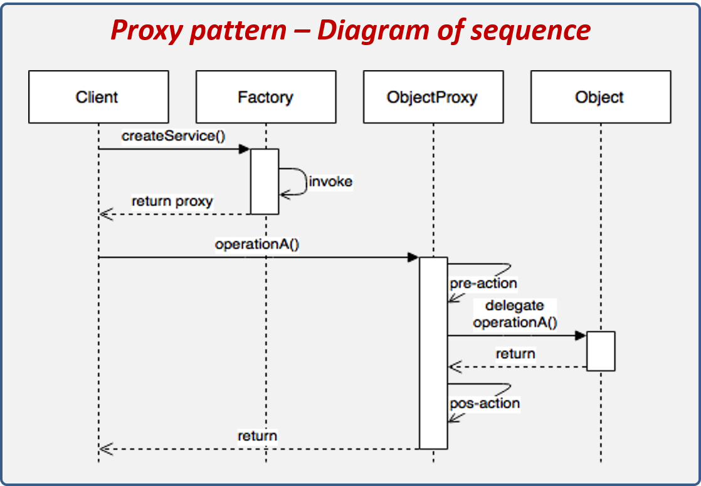
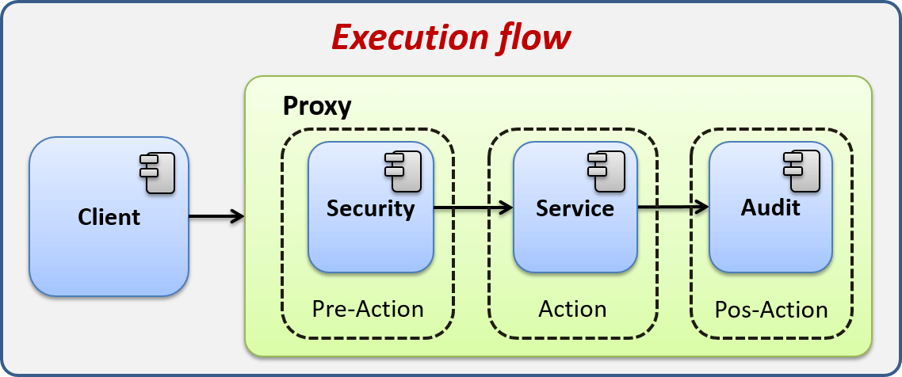

# Proxy
Este es un patrón de diseño que centra su atención en la mediación entre un objeto y otro. Se dice mediación porque este patrón nos permite realizar ciertas acciones antes y después de realizar la acción deseada por el usuario. El Proxy se caracteriza por que el cliente ignora totalmente que una mediación se está llevando acabo debido a que el cliente recibe un objeto idéntico en estructura al esperado, y no es consciente de la implementación tras la interface ejecutada, de esta manera el cliente interactúa con el Proxy sin saberlo.

#### Los componentes que conforman el patrón son los siguientes:

Los componentes del patrón se explican a continuación:

* IObject: Representa la interface común entre el Objet y el Proxy.
*  Object: Representa el objeto al que el cliente quiere ejecutar.
*  Proxy: Clase que implementa IObject y delega la responsabilidad al Object, sin embargo, puede realizar una acción antes y después de llamar al Object.

#### Pasos de ejecución:

* El cliente solicita al Factory un Objeto.
*  El Factory crea un Proxy que encapsule al Object.
*  El cliente ejecuta el Proxy creado por el Factory.
*  El Proxy realiza una o varias acciones previas a la ejecución del Object.
*  El Proxy delega la ejecución al Object.
*  El Proxy realiza una o varias acciones después de la ejecución del Object.
*  El Proxy regresa un resultado.

## Proxy - Explicación del escenario
Nos han pedido que desarrollemos un portal para ejecutar procesos, estos procesos solamente pueden ser ejecutados por personas autorizadas y deben ser auditadas, de tal forma que si un usuario ejecuta un proceso este deberá quedar registrado para su posterior análisis.

El cliente nos ha pedido que se puedan realizar algunas acciones previas a la ejecución y otras acciones posteriores, pero aún no está seguro, por lo que es importante dejar el sistema preparado para agregar estas nuevas acciones sin realizar un gran impacto en las clases existentes.

#### Para dar solución a este problema nos han proporcionado los servicios:

*   **SecurityService:** Servicio que valida si el usuario tiene privilegios para ejecutar el proceso.
*   **AuditService:** Servicio para registrar cuando un usuario ejecuta un proceso.

En la imagen vemos que el cliente es el encargado de validar si tiene privilegios, luego ejecutar el proceso y finalmente hacer la auditoria. Este escenario plantea dos problemas: el primero es que si agregamos una acción previa o posterior a la ejecución del proceso tendremos que modificar al Client para que realice esta acción, la segunda es que el cliente se está encargando de hacer los pasos previos y posteriores, siendo que está no es responsabilidad del cliente, ya que a él lo único que le interesa es ejecutar los procesos.