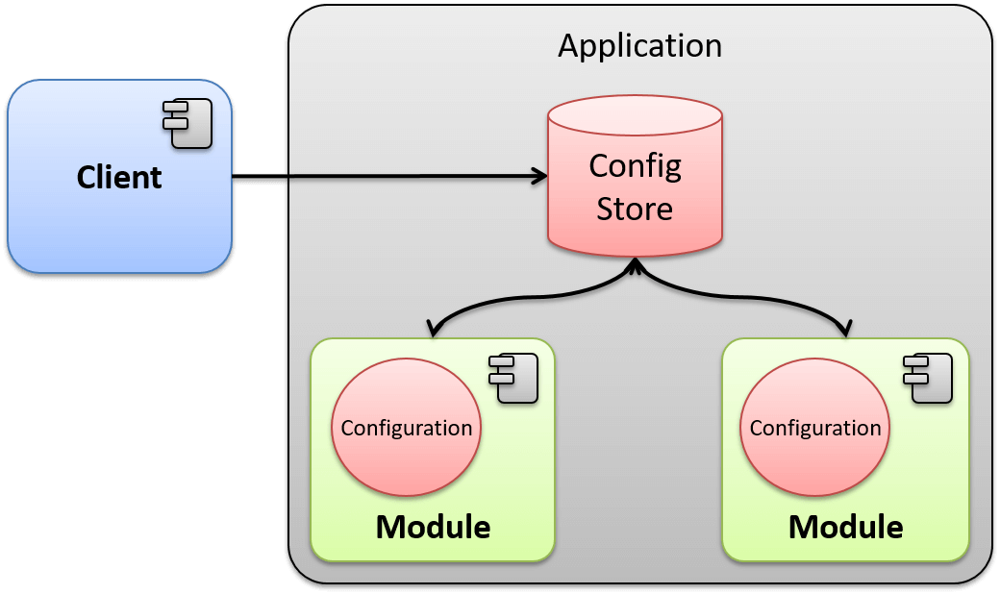

# Singleton

El patrón de diseño Singleton (soltero) recibe su nombre debido a que sólo se puede tener una única instancia para toda la aplicación de una determinada clase, esto se logra restringiendo la libre creación de instancias de esta clase mediante el operador new e imponiendo un constructor privado y un método estático para poder obtener la instancia.

La intención de este patrón es garantizar que solamente pueda existir una única instancia de una determinada clase y que exista una referencia global en toda la aplicación.

Los componentes que conforman el patrón son los siguientes:

Client: Componente que desea obtener una instancia de la clase Singleton.
Singleton: Clase que implementa el patrón Singleton, de la cual únicamente se podrá tener una instancia durante toda la vida de la aplicación.

## Singleton - Explicación del escenario

Para comprender mejor cómo es que funciona este patrón realizaremos un ejemplo simple. Se ha solicitado crear una aplicación que, como parte de su proceso de inicio, cargue la configuración persistida en un archivo de propiedades, esta configuración deberá estar disponible para toda la aplicación incluyendo los módulos que ésta podría tener. Dicha configuración tiene un requerimiento especial y es que deberá existir un solo objeto de configuración en toda la aplicación, en la cual todos los módulos puedan interactuar, de tal manera que si un módulo afecta alguna propiedad de la configuración el resto del módulo lo pueda ver reflejado.

En la imagen podemos apreciar un escenario donde cada módulo de la aplicación lee directamente la configuración obteniendo con esto que cada uno tenga un objeto de configuración distinto, si uno de los módulos afecta la configuración, el resto de los módulos no será capaz de verlo; obteniendo con esto un grave problema, de igual forma si uno decide guardar la configuración sobrescribirá la configuración que otro módulo ha guardado.